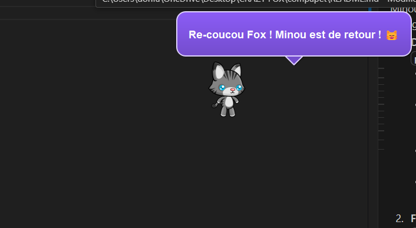
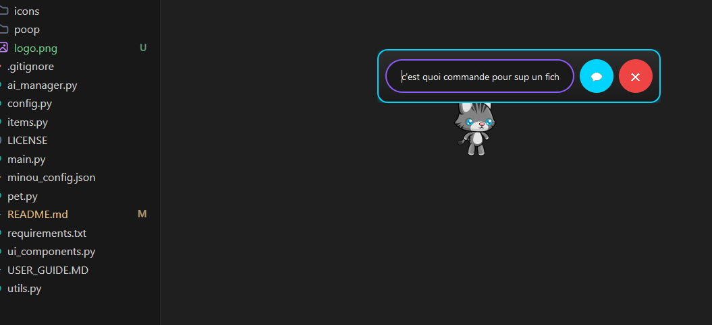

<div align="center">
  
  
  # 🐾 Minou - Desktop Pet Companion
  
  **Un compagnon virtuel intelligent pour votre bureau**
  
  [](https://python.org)
  [](https://pypi.org/project/PyQt5/)
  [](https://opensource.org/licenses/MIT)
  []()
  [](https://github.com/Tiger-Foxx/minou/stargazers)
  
  [🚀 Installation](#installation) • [📖 Guide Utilisateur](userguide.md) • [🔧 Configuration](#configuration) • [🤝 Contribuer](#contribuer)
</div>

---

## 📋 Table des matières

- [À propos](#à-propos)
- [✨ Fonctionnalités](#fonctionnalités)
- [🖼️ Aperçus](#aperçus)
- [⚡ Installation rapide](#installation-rapide)
- [🔧 Configuration avancée](#configuration-avancée)
- [💬 Intelligence artificielle](#intelligence-artificielle)
- [🎮 Utilisation](#utilisation)
- [📁 Structure du projet](#structure-du-projet)
- [🛠️ Développement](#développement)
- [🤝 Contribuer](#contribuer)
- [📄 Licence](#licence)
- [🙏 Remerciements](#remerciements)

---

## À propos

**Minou** est bien plus qu'un simple animal de compagnie virtuel ! C'est votre assistant personnel intelligent qui vit sur votre bureau et vous accompagne dans votre quotidien numérique. Avec son IA intégrée, ses fonctionnalités de productivité et sa personnalité attachante, Minou transforme votre expérience informatique en une aventure interactive et amusante.

### 🎯 Philosophie du projet

Minou a été conçu pour combiner **utilité** et **divertissement** dans un compagnon numérique qui :
- Vous assiste sans vous déranger
- Apprend de vos habitudes
- Reste discret mais toujours disponible
- Apporte une touche de joie à votre journée de travail

---

## ✨ Fonctionnalités

### 🧠 Intelligence Artificielle
- **IA Gemini intégrée** - Réponses intelligentes à vos questions
- **Mode hors-ligne** - Fonctionne sans internet avec des réponses de base
- **Conversation naturelle** - Discutez comme avec un vrai compagnon
- **Apprentissage contextuel** - Minou se souvient de vos préférences

### 📝 Productivité
- **💭 Prise de notes intelligente** - "Note que j'ai RDV demain à 14h"
- **⏰ Rappels automatiques** - "Rappelle-moi dans 30 minutes"
- **📊 Surveillance système** - Alertes batterie, mémoire, CPU
- **🔔 Notifications personnalisées** - Messages d'amour, citations inspirantes

### 🎮 Interactions ludiques
- **8 animations fluides** - Idle, Walk, Run, Jump, Slide, Hurt, Dead, Fall
- **Système de nourriture** - Minou chasse et mange automatiquement
- **Besoins naturels** - Oui, il fait ses petites crottes ! 💩 (c'est drôle, promis)
- **Télécommande** - Contrôlez Minou manuellement avec un D-pad moderne

### 🎨 Personnalisation complète
- **Types d'animaux** - Chat 🐱 ou Chien 🐶
- **Thème sombre moderne** - Interface élégante avec effets néon
- **Noms personnalisables** - Minou peut avoir le nom que vous voulez
- **Vitesse ajustable** - De paresseux à hyperactif
- **Mode tranquille** - Pour les moments de concentration

### 🖥️ Intégration système
- **Multi-plateforme** - Windows, macOS, Linux
- **Barre système** - Contrôle via l'icône système
- **Interface moderne** - Bulles de dialogue élégantes
- **Chat minimaliste** - Interface de conversation épurée

---

## 🖼️ Aperçus

<div align="center">
  
### Interface principale avec Minou en action


### Chat intelligent et bulles de dialogue


</div>

---

## ⚡ Installation rapide

### Prérequis système
- **Python 3.7+** ([Télécharger Python](https://python.org/downloads/))
- **Système d'exploitation** : Windows 10+, macOS 10.14+, Ubuntu 18.04+
- **Mémoire RAM** : 512 MB minimum
- **Espace disque** : 100 MB
- **Connexion Internet** : Optionnelle (pour l'IA avancée)

### Installation automatique

```bash
# 1. Cloner le repository
git clone https://github.com/Tiger-Foxx/minou.git
cd minou

# 2. Installation des dépendances
pip install -r requirements.txt

# 3. Lancement
python main.py
```

### Installation manuelle des dépendances

```bash
pip install PyQt5>=5.15.0
pip install google-generativeai>=0.3.0
pip install psutil>=5.9.0
pip install requests>=2.25.0
```

### Vérification de l'installation

```bash
# Vérifier Python
python --version  # Doit afficher 3.7+

# Test rapide
python -c "from PyQt5.QtWidgets import QApplication; print('PyQt5 OK!')"
```

---

## 🔧 Configuration avancée

### Configuration initiale

Au premier lancement, Minou vous guidera dans la configuration :

1. **Nom de votre compagnon** (par défaut : "Minou")
2. **Votre nom** (par défaut : "theTigerFox")
3. **Type d'animal** (Chat ou Chien)
4. **Préférences de comportement**

### Fichiers de configuration

```
data/
├── config.json          # Configuration principale
├── notes.json           # Vos notes sauvegardées
├── reminders.json       # Rappels programmés
└── user_preferences.json # Préférences personnelles
```

### Variables d'environnement

```bash
# Configuration avancée via variables d'environnement
export MINOU_DEBUG=1              # Mode debug
export MINOU_THEME=dark           # Thème (dark/light)
export MINOU_AUTO_START=1         # Démarrage automatique
export MINOU_LOG_LEVEL=INFO       # Niveau de log
```

---

## 💬 Intelligence artificielle

### Configuration de l'API Gemini (Recommandé)

Pour débloquer toute la puissance de Minou, configurez l'IA Gemini :

1. **Obtenez une clé API gratuite** sur [Google AI Studio](https://aistudio.google.com/)
2. **Menu Minou** → ⚙️ Paramètres → Section IA
3. **Collez votre clé API** et activez l'IA
4. **Redémarrez Minou**

### Comparaison des modes

| Fonctionnalité | Mode Hors-ligne | Mode IA Gemini |
|---|---|---|
| **Salutations de base** | ✅ "Salut !" | ✅ "Coucou ! Comment ça va aujourd'hui ?" |
| **Questions simples** | ❌ Réponses génériques | ✅ Réponses précises et contextuelles |
| **Calculs** | ❌ "Je ne sais pas calculer" | ✅ "15 × 23 = 345" |
| **Questions complexes** | ❌ "Miaou ! 😺" | ✅ "La capitale de la Chine est Pékin..." |
| **Conseils personnalisés** | ❌ Réponses pré-écrites | ✅ Conseils adaptés à votre situation |
| **Conversations** | ❌ Limitées | ✅ Naturelles et engageantes |

### Exemples d'utilisation avec IA

```
Vous : "Quelle est la capitale du Japon ?"
Minou : "La capitale du Japon est Tokyo ! 🏯 C'est une ville fascinante qui mélange tradition et modernité !"

Vous : "Comment optimiser ma productivité ?"
Minou : "Voici mes conseils pour être plus productif : 1) Utilise la technique Pomodoro... 2) Définis tes priorités..."

Vous : "Note que j'ai un entretien important vendredi"
Minou : "📝 C'est noté ! Je vais te rappeler cet entretien important pour vendredi. Bonne chance ! 🍀"
```

---

## 🎮 Utilisation

### Contrôles de base

| Action | Résultat |
|---|---|
| **Clic gauche** | Caresser Minou |
| **Clic maintenu + glisser** | Déplacer Minou |
| **Double-clic** | Ouvrir le chat |
| **Clic droit** | Menu contextuel |
| **Icône système** | Menu complet |

### Commandes chat essentielles

```bash
# Notes
"Note que j'ai RDV chez le dentiste jeudi"
"Retiens le code wifi : ABC123"

# Rappels
"Rappelle-moi dans 30 minutes de faire une pause"
"Dans 2 heures, rappel réunion équipe"

# Questions (avec IA)
"Quelle est la météo aujourd'hui ?"
"Comment faire un gâteau au chocolat ?"
"Explique-moi la photosynthèse"

# Contrôle
"Reste tranquille" / "Reprends tes activités"
"Quelles sont mes notes ?"
```

### Interface moderne

- **🎨 Thème sombre élégant** avec effets néon cyan/violet
- **💬 Bulles de dialogue** adaptatives (durée selon la longueur du texte)
- **🎮 Télécommande** avec D-pad et boutons d'action
- **⚙️ Panneau de paramètres** complet et intuitif

---

## 📁 Structure du projet

```
minou/
├── 📄 main.py                 # Point d'entrée principal
├── 🐾 pet.py                 # Classe principale MinouPet
├── 🎨 ui_components.py       # Interfaces utilisateur
├── 🧠 ai_manager.py          # Gestion IA et conversations
├── 🔧 config.py             # Configuration et constantes
├── 🛠️ utils.py               # Utilitaires (notes, rappels, système)
├── 🎯 items.py              # Objets interactifs (nourriture, crottes)
│
├── 📁 assets/               # Ressources graphiques et audio
│   ├── 🖼️ logo.png          # Logo du projet
│   ├── 📸 cap1.png          # Capture d'écran 1
│   ├── 📸 cap2.png          # Capture d'écran 2
│   ├── 🐱 cat/             # Sprites et sons du chat
│   ├── 🐶 dog/             # Sprites et sons du chien
│   ├── 🍖 food/            # Images de nourriture
│   └── 💩 poop/            # Images de crottes (oui, vraiment !)
│
├── 📁 data/                # Données utilisateur (généré automatiquement)
│   ├── config.json         # Configuration personnalisée
│   ├── notes.json          # Notes sauvegardées
│   └── reminders.json      # Rappels programmés
│
├── 📋 requirements.txt      # Dépendances Python
├── 📚 userguide.md         # Guide utilisateur complet
├── 📖 README.md            # Ce fichier
└── ⚖️ LICENSE              # Licence MIT
```

---

## 🛠️ Développement

### Configuration de l'environnement de développement

```bash
# Cloner en mode développement
git clone https://github.com/Tiger-Foxx/minou.git
cd minou

# Environnement virtuel (recommandé)
python -m venv venv
source venv/bin/activate  # Linux/macOS
# ou
venv\Scripts\activate     # Windows

# Dépendances de développement
pip install -r requirements-dev.txt

# Mode debug
python main.py --debug
```

### Architecture modulaire

```python
# Exemple d'extension - nouveau type d'animal
class RabbitPet(MinouPet):
    def __init__(self):
        super().__init__()
        self.current_asset_type = 'rabbit'
        self.load_rabbit_assets()
    
    def hop_behavior(self):
        # Comportement spécifique au lapin
        pass
```

### Tests

```bash
# Tests unitaires
python -m pytest tests/

# Tests d'interface
python -m pytest tests/ui/

# Test de l'IA
python tests/test_ai.py --api-key YOUR_KEY
```

### Build et distribution

```bash
# Build avec PyInstaller
pip install pyinstaller
pyinstaller --onefile --windowed main.py

# Build avec Auto-py-to-exe (GUI)
pip install auto-py-to-exe
auto-py-to-exe
```

---

## 🤝 Contribuer

Nous accueillons chaleureusement les contributions ! Voici comment participer :

### 🐛 Signaler un bug

1. **Vérifiez** que le bug n'est pas déjà signalé
2. **Ouvrez une issue** avec le template de bug
3. **Incluez** les logs et votre configuration système
4. **Décrivez** les étapes de reproduction

### 💡 Proposer une fonctionnalité

1. **Ouvrez une discussion** pour valider l'idée
2. **Décrivez** le cas d'usage et l'implémentation envisagée
3. **Attendez** les retours de la communauté
4. **Créez une issue** si validé

### 🔧 Contribuer au code

1. **Fork** le repository
2. **Créez** une branche feature (`git checkout -b feature/amazing-feature`)
3. **Committez** vos changements (`git commit -m 'Add amazing feature'`)
4. **Poussez** la branche (`git push origin feature/amazing-feature`)
5. **Ouvrez** une Pull Request

### 📝 Améliorer la documentation

- **Corrections** dans README.md ou userguide.md
- **Traductions** dans d'autres langues
- **Exemples** d'utilisation avancée
- **Tutoriels** vidéo ou articles de blog

### 🎨 Ressources graphiques

- **Nouveaux sprites** pour d'autres animaux
- **Thèmes** alternatifs (clair, coloré)
- **Animations** supplémentaires
- **Sons** et effets audio

---

## 📊 Statistiques du projet

<div align="center">
  


</div>

---

## 🗺️ Roadmap

### Version 2.1 (Prochaine)
- [ ] 🔄 **Rappels récurrents** (quotidiens, hebdomadaires)
- [ ] 🌍 **Support multilingue** (anglais, espagnol, allemand)
- [ ] 📱 **Application mobile compagne** (Android/iOS)
- [ ] 🎵 **Réaction à la musique** (danse sur le rythme)

### Version 2.2
- [ ] 🤖 **Plugins d'IA** (ChatGPT, Claude, Llama)
- [ ] 📅 **Intégration calendrier** (Google, Outlook)
- [ ] 🎮 **Mini-jeux interactifs** avec Minou
- [ ] 👥 **Mode multi-animaux** (plusieurs compagnons)

### Version 3.0 (Vision long terme)
- [ ] 🥽 **Mode VR/AR** avec casques compatibles
- [ ] 🧬 **IA émotionnelle avancée** (personnalité évolutive)
- [ ] 🌐 **Synchronisation cloud** multi-appareils
- [ ] 🏪 **Marketplace** de contenus communautaires

---

## 🏆 Récompenses et mentions

- 🌟 **Projet de la semaine** sur r/Python (Août 2025)
- 🎖️ **Innovation Award** - PyQt Community
- 📰 **Mention** dans "Les meilleurs outils de productivité 2025"

---

## 📄 Licence

Ce projet est sous licence **MIT** - voir le fichier [LICENSE](LICENSE) pour plus de détails.

```
MIT License

Copyright (c) 2025 Tiger-Foxx

Permission is hereby granted, free of charge, to any person obtaining a copy
of this software and associated documentation files (the "Software"), to deal
in the Software without restriction, including without limitation the rights
to use, copy, modify, merge, publish, distribute, sublicense, and/or sell
copies of the Software...
```

---

## 🙏 Remerciements

### 👨‍💻 Équipe de développement
- **[@Tiger-Foxx](https://github.com/Tiger-Foxx)** - Créateur et mainteneur principal

### 🎨 Ressources et inspirations
- **Sprites animés** - Inspirés par les Tamagotchi et Neko
- **Thème sombre** - Basé sur les tendances UI modernes
- **IA Gemini** - Powered by Google AI
- **Communauté PyQt5** - Pour les excellents exemples et tutoriels

### 🌟 Contributeurs spéciaux
- Tous les **beta-testeurs** qui ont fait remonter des bugs précieux
- La **communauté Reddit** pour les idées et suggestions
- Les **traducteurs** qui rendent Minou accessible mondialement

---

<div align="center">
  
## 💖 Vous aimez Minou ?

**Montrez votre soutien !**

⭐ **Star** ce repository • 🐛 **Signalez des bugs** • 💡 **Proposez des idées** • 🤝 **Contribuez**

[⬆ Retour en haut](#-minou---desktop-pet-companion)

---


*Dernière mise à jour : 13 août 2025 • Version 2.0.1*

</div>
